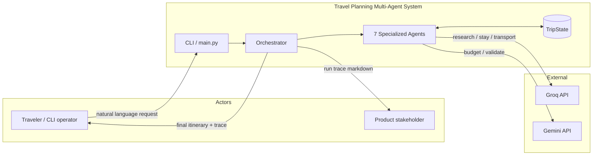
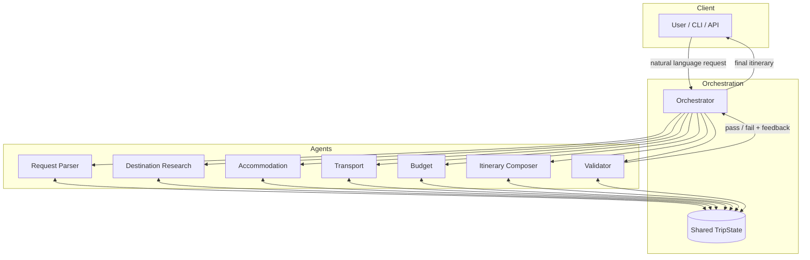
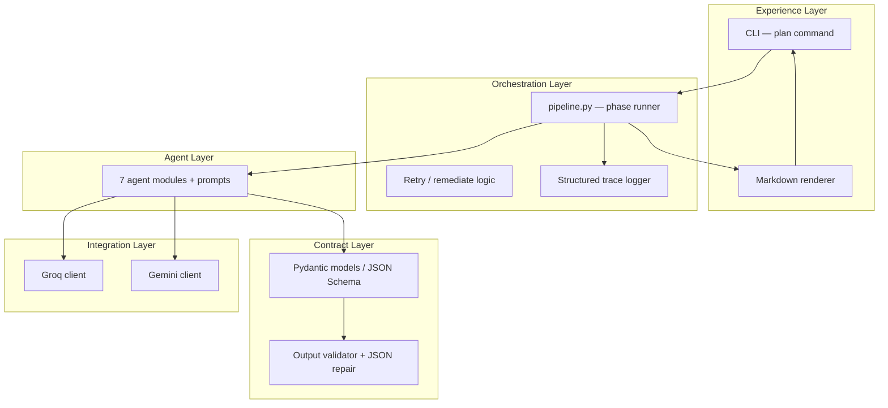
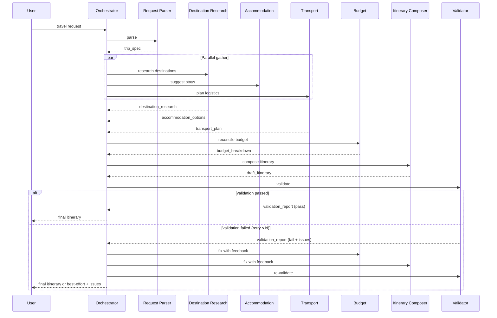
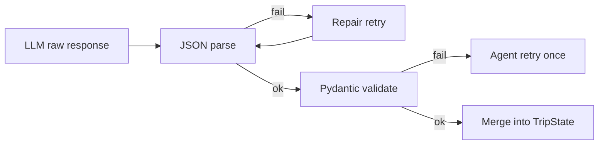
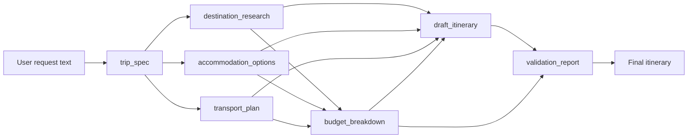

# Architecture — Travel Planning Multi-Agent System

## 1. Purpose & Scope

This document describes the **system architecture** for Milestone 4: an **AI Travel Planner** that turns a short natural-language travel request into a validated, day-by-day trip plan using a **supervisor orchestrator** and **seven specialized agents**.

The design prioritizes **clarity for product stakeholders** and a **clean separation of concerns for engineers**. Correct orchestration and explainable output matter more than domain-perfect travel recommendations.

**In scope**

- Parsing natural-language trip requests into structured `trip_spec`
- Multi-agent pipeline with shared `TripState`
- Parallel gather phase (research, accommodation, transport)
- Budget reconciliation and itinerary synthesis
- Validation loop with targeted retries
- CLI entrypoint and structured observability
- Phase 1: fully **LLM-driven** recommendations (labeled as estimates)

**Out of scope (MVP)**

- Real-time booking, payments, or live inventory APIs
- Production-grade latency, cost optimization, or global scale
- Direct agent-to-agent communication
- Human-in-the-loop approval (deferred to v2)
- External maps / hotel / flight APIs (deferred to v1.2)

**Related documents:** [problemstatement.md](./problemstatement.md) (product intent), `implementation-plan.md` (build phases), `eval.md` (acceptance tests).

---

## 2. Goals and Non-Goals

### Goals

| Goal | How architecture supports it |
|------|------------------------------|
| Turn a short natural-language request into a useful trip plan | Pipeline of specialized agents with a single orchestrated workflow |
| Demonstrate multi-agent collaboration | Each agent owns one slice of travel planning; shared artifacts coordinate work |
| Stay understandable to product managers | Named agents map 1:1 to planning tasks travelers already think about |
| Respect preferences and constraints | Structured `trip_spec` + validation loop before delivery |
| Show two LLM "brains" | Groq for gather-phase agents; Gemini for budget + validator |

### Non-Goals

- Perfect travel recommendations — orchestration and transparency come first
- Monolithic single-prompt planning — explicitly rejected in favor of agent boundaries
- Stateful long-running sessions — MVP uses in-memory `TripState` per run

---

## 3. System Context

The system sits between a **traveler (or demo operator)** and **LLM providers**, producing a markdown itinerary artifact.



| Actor | Interaction |
|-------|-------------|
| **Traveler / operator** | Submits request via CLI; receives final itinerary |
| **Orchestrator** | Schedules agents, enforces phases, handles retries |
| **Agents** | Read/write artifacts on shared state; no peer calls |
| **LLM providers** | Groq (gather) and Gemini (constrain + verify) |
| **PM / reviewer** | Reads trace log and "How this plan was built" section |

---

## 4. Architectural Principles

| Principle | Meaning for this project |
|-----------|--------------------------|
| **Single writer per artifact** | Each `TripState` field has exactly one primary owner agent |
| **Orchestrator-only routing** | Agents never call each other; all coordination goes through the supervisor |
| **Structured contracts** | Pydantic models + JSON Schema for every agent output |
| **Ground in trip_spec** | Every post-parse agent receives `trip_spec` to reduce hallucination drift |
| **Fail visibly** | Validation failures, budget overruns, and agent errors surface in `validation_report` |
| **Parallel when independent** | Phase 2 runs Research, Accommodation, Transport concurrently |
| **Idempotent structure** | Same inputs should yield stable artifact shapes (content may vary with LLM) |
| **Explainability by default** | Final output documents which agent contributed what |

---

## 5. High-Level System View

**Pattern:** Supervisor orchestrator with **shared trip state** (single source of truth). Agents are stateless workers; they read from and write to shared artifacts. The orchestrator decides order, parallelism, and retry loops.



### Layered view



---

## 6. Core Concepts

### 6.1 Trip Request (input)

Raw user text. Example:

```
Plan a 5-day trip to Japan. Tokyo + Kyoto. $3,000 budget. Love food and temples, hate crowds.
```

Stored on `TripState.raw_request` for validator cross-check.

### 6.2 Trip Spec (structured contract)

Produced by the **Request Parser Agent**. All downstream agents consume this object.

```json
{
  "duration_days": 5,
  "destinations": ["Tokyo", "Kyoto"],
  "country": "Japan",
  "budget_usd": 3000,
  "preferences": ["food", "temples"],
  "constraints": ["avoid crowds"],
  "travel_style": "mid-range",
  "party_size": 1,
  "assumptions": ["Single traveler unless stated otherwise"]
}
```

Fields may be inferred with defaults when omitted (e.g. `party_size: 1`, `travel_style: "mid-range"`). Assumptions are listed explicitly for transparency.

### 6.3 Shared Trip State (working memory)

Evolves through the pipeline. One `TripState` instance per `run_id`.

| Field | Primary owner | Description |
|-------|---------------|-------------|
| `raw_request` | Orchestrator (input) | Original user message |
| `trip_spec` | Request Parser | Parsed constraints and preferences |
| `destination_research` | Destination Research | Attractions, areas, timing tips per city |
| `accommodation_options` | Accommodation | Neighborhoods, stay recommendations |
| `transport_plan` | Transport | Inter-city and local logistics |
| `budget_breakdown` | Budget | Estimated costs by category |
| `draft_itinerary` | Itinerary Composer | Day-by-day outline |
| `validation_report` | Validator | Pass/fail + gaps vs. original request |
| `metadata` | Orchestrator | `run_id`, timestamps, phase, retry count |

### 6.4 Final Itinerary (output)

Delivered to the user as markdown. Must include everything from [problemstatement.md](./problemstatement.md):

1. Day-by-day trip outline
2. Suggested neighborhoods / areas to stay
3. Travel logistics between cities
4. Budget-friendly recommendations
5. Evidence that preferences and constraints were respected
6. "How this plan was built" (agent trace summary)
7. Validator sign-off or explicit unresolved issues

---

## 7. Agent Catalog

Each agent maps to a real planning concern. All implement the same conceptual interface:

```python
def run(state: TripState, context: AgentContext) -> TripState:
    ...
```

- **Pure relative to peers:** no direct agent-to-agent calls
- **Idempotent where possible:** same inputs → stable structure

### 7.1 Request Parser Agent

| Attribute | Value |
|-----------|-------|
| **Purpose** | Understand the traveler's goals; extract structured constraints |
| **Inputs** | `raw_request` |
| **Outputs** | `trip_spec` |
| **LLM** | Groq (lightweight extraction) |
| **Does** | Parse duration, cities, budget, likes/dislikes; flag ambiguities |
| **Does not** | Recommend hotels or build day-by-day schedules |

**Prompt focus:** *"Extract only what is stated or strongly implied; list assumptions separately."*

### 7.2 Destination Research Agent

| Attribute | Value |
|-----------|-------|
| **Purpose** | Research destinations and attractions aligned with preferences |
| **Inputs** | `trip_spec` |
| **Outputs** | `destination_research` |
| **LLM** | Groq |
| **Does** | Food spots, temples, cultural sites; crowd-avoidance timing hints |
| **Does not** | Price totals or hotel booking |

**Output shape (per city):** POIs, vibe, best times, crowd tips, estimated visit durations.

### 7.3 Accommodation Agent

| Attribute | Value |
|-----------|-------|
| **Purpose** | Compare stay options; suggest neighborhoods |
| **Inputs** | `trip_spec`, `destination_research` |
| **Outputs** | `accommodation_options` |
| **LLM** | Groq |
| **Does** | Match neighborhoods to itinerary flow (transit, food districts) |
| **Does not** | Own inter-city transport or daily activity sequencing |

### 7.4 Transport Agent

| Attribute | Value |
|-----------|-------|
| **Purpose** | Plan travel logistics between cities and within cities |
| **Inputs** | `trip_spec`, `accommodation_options` |
| **Outputs** | `transport_plan` |
| **LLM** | Groq |
| **Does** | Inter-city legs, airport transfers, local transit notes, pass suggestions |
| **Does not** | Activity curation or budget reconciliation |

### 7.5 Budget Agent

| Attribute | Value |
|-----------|-------|
| **Purpose** | Stay within budget; surface budget-friendly choices |
| **Inputs** | `trip_spec`, `accommodation_options`, `transport_plan`, `destination_research` |
| **Outputs** | `budget_breakdown` |
| **LLM** | Gemini (second "brain" — cross-checks gather-phase estimates) |
| **Does** | Estimate costs by category; flag over-budget risks; suggest tradeoffs |
| **Does not** | Rewrite full narrative itinerary |

### 7.6 Itinerary Composer Agent

| Attribute | Value |
|-----------|-------|
| **Purpose** | Synthesize a coherent day-by-day plan |
| **Inputs** | All prior artifacts |
| **Outputs** | `draft_itinerary` |
| **LLM** | Groq |
| **Does** | Allocate days across cities; sequence activities; weave transport and stays |
| **Does not** | Final compliance sign-off (Validator owns that) |

### 7.7 Validator Agent

| Attribute | Value |
|-----------|-------|
| **Purpose** | Check whether the plan matches the original request |
| **Inputs** | `raw_request`, `trip_spec`, `draft_itinerary`, `budget_breakdown` |
| **Outputs** | `validation_report` |
| **LLM** | Gemini |
| **Does** | Verify duration, cities, budget, preferences, constraints |
| **Does not** | Rebuild the entire itinerary |

**Minimum validation rules:**

| Rule | Check |
|------|-------|
| Duration | Trip length equals `duration_days` |
| Destinations | All cities in `trip_spec.destinations` appear in outline |
| Budget | Estimated total ≤ `budget_usd`, or explicit overage documented |
| Preferences | Each preference reflected at least once |
| Constraints | Each constraint addressed (e.g. crowd-avoidance strategies present) |

**`validation_report` shape:**

```json
{
  "status": "pass",
  "issues": [],
  "suggestions": [],
  "checks": [
    { "rule": "duration", "passed": true, "detail": "5 days planned" },
    { "rule": "budget", "passed": true, "detail": "Total $2,850 ≤ $3,000" }
  ]
}
```

---

## 8. Orchestration

### 8.1 Workflow phases



| Phase | Agents | Parallelism |
|-------|--------|-------------|
| 1. Understand | Request Parser | Sequential (must run first) |
| 2. Gather | Destination Research, Accommodation, Transport | **Parallel** |
| 3. Constrain | Budget | Sequential (needs phase 2) |
| 4. Synthesize | Itinerary Composer | Sequential |
| 5. Verify | Validator | Sequential |
| 6. Remediate | Orchestrator + subset of agents | Conditional loop |

### 8.2 Retry policy

| Setting | Default |
|---------|---------|
| Max validation retries | `2` (configurable via env / config) |
| JSON repair retries per agent | `1` |
| Per-agent timeout | `60s` (configurable) |

**On validation failure:**

1. Orchestrator attaches `validation_report.issues` to `AgentContext.validation_feedback`
2. Re-run **Budget** and/or **Itinerary Composer** with the fix list (not the full pipeline)
3. Re-run **Validator**
4. If still failing after max retries → return **best-effort itinerary** plus explicit unresolved issues

**On agent failure (timeout / API error):**

1. Single agent retry with exponential backoff
2. If still failing → continue with partial state + warning in trace (degrade gracefully)

### 8.3 Orchestrator responsibilities

- Instantiate agents and inject shared `TripState`
- Enforce phase ordering and timeouts
- Run phase 2 with `asyncio.gather` (or thread pool)
- Log agent inputs/outputs per `run_id` for traceability
- Merge artifacts into state after schema validation
- Render final markdown from state
- Export trace as markdown for PM review

---

## 9. Communication and Contracts

### 9.1 Message envelope (agent ↔ orchestrator)

```json
{
  "run_id": "550e8400-e29b-41d4-a716-446655440000",
  "agent": "destination_research",
  "phase": 2,
  "input_artifacts": ["trip_spec"],
  "output_artifact": "destination_research",
  "context": {
    "validation_feedback": null,
    "retry_attempt": 0
  },
  "timestamp": "2026-06-18T10:30:00Z"
}
```

### 9.2 Prompt boundaries

| Principle | Rationale |
|-----------|-----------|
| One agent = one system prompt persona | Clear ownership for demos and debugging |
| Pass only required artifact slices | Reduces token cost and cross-talk |
| Require structured JSON output | Orchestrator can merge reliably |
| Include `trip_spec` in every post-parse call | Grounds all agents in user constraints |
| Label estimates explicitly | Phase 1 uses LLM knowledge, not live APIs |

### 9.3 Schema validation flow



---

## 10. LLM Routing

MVP uses **two providers** to demonstrate multiple "brains" in the system:

| Agent | Provider | Model (example) | Rationale |
|-------|----------|-----------------|-----------|
| Request Parser | Groq | `llama-3.3-70b-versatile` | Fast structured extraction |
| Destination Research | Groq | `llama-3.3-70b-versatile` | Creative research, lower latency |
| Accommodation | Groq | `llama-3.3-70b-versatile` | Neighborhood reasoning |
| Transport | Groq | `llama-3.3-70b-versatile` | Route and mode planning |
| Budget | Gemini | `gemini-3-flash` | Independent cost cross-check |
| Itinerary Composer | Groq | `llama-3.3-70b-versatile` | Narrative synthesis |
| Validator | Gemini | `gemini-3-flash` | Independent QA pass |

API keys via environment variables: `GROQ_API_KEY`, `GEMINI_API_KEY`. Never commit `.env`.

### Rate limits (free tier)

Enforced client-side in `rate_limiter.py`. See [implementation-plan.md § API Rate Limits](./implementation-plan.md#api-rate-limits).

| Provider | Model | RPM | RPD | TPM | Notes |
|----------|-------|-----|-----|-----|-------|
| Groq | `llama-3.3-70b-versatile` | 30 | 1,000 | 12,000 | 100K TPD; 5 agents/run |
| Gemini | `gemini-3-flash` | 5 | 20 | 250,000 | **Daily bottleneck** — 2 agents/run |

---

## 11. Data Flow (Japan Example)



**Illustrative slice after Itinerary Composer:**

| Day | City | Theme | Logistics |
|-----|------|-------|-----------|
| 1 | Tokyo | Arrival, light food walk | Airport → hotel area |
| 2 | Tokyo | Temples (early), food | Local metro |
| 3 | Tokyo → Kyoto | Shinkansen | Book off-peak |
| 4 | Kyoto | Temples, kaiseki | Bus / walk |
| 5 | Kyoto / depart | Markets, buffer | Train to airport |

**Validator checks:** 5 days ✓, Tokyo + Kyoto ✓, food + temples ✓, crowd mitigations ✓, total ≤ $3,000 ✓.

---

## 12. Suggested Repository Layout

```
travel-agent/
├── docs/
│   ├── problemstatement.md
│   ├── architecture.md          # this file
│   ├── implementation-plan.md
│   ├── edgecases.md
│   └── eval.md
├── src/
│   ├── orchestrator/
│   │   ├── pipeline.py          # phase runner, retry logic
│   │   ├── state.py             # TripState Pydantic models
│   │   └── renderer.py          # markdown output
│   ├── agents/
│   │   ├── base.py              # Agent protocol
│   │   ├── request_parser.py
│   │   ├── destination_research.py
│   │   ├── accommodation.py
│   │   ├── transport.py
│   │   ├── budget.py
│   │   ├── itinerary_composer.py
│   │   └── validator.py
│   ├── llm/
│   │   ├── groq_client.py
│   │   └── gemini_client.py
│   ├── prompts/                 # one file per agent
│   ├── schemas/                 # JSON schemas for artifacts
│   └── main.py                  # CLI entrypoint
├── tests/
│   ├── fixtures/                # Japan request + golden shapes
│   └── test_validator.py
├── outputs/                     # run artifacts (gitignored)
├── .env.example
└── pyproject.toml
```

---

## 13. Technology Choices

| Layer | Choice | Notes |
|-------|--------|-------|
| Language | Python 3.11+ | Fast iteration; strong LLM SDK ecosystem |
| LLM — gather | Groq SDK | Research, accommodation, transport, parser, composer |
| LLM — constrain/verify | Google Gemini SDK | Budget and validator |
| Orchestration | Custom lightweight supervisor | Avoid LangGraph until complexity demands it |
| Schemas | Pydantic v2 + JSON Schema | Validate before merge |
| Concurrency | `asyncio` | Phase 2 parallel agent calls |
| Interface | CLI first (`plan "..."`) | Optional FastAPI wrapper later |
| Observability | Structured JSON logs + markdown trace | One file per `run_id` under `outputs/` |
| Config | `pydantic-settings` + `.env` | Timeouts, retry limits, model names |

External APIs (maps, hotels, flights) are **deferred to Data v1.2+**; build phases 2–4 continue with LLM-only data. All estimates use clear **"estimated"** labeling in output.

---

## 14. Cross-Cutting Concerns

### 14.1 Security and privacy

- Treat user requests as sensitive; do not log full text to third-party analytics without redaction
- API keys via environment variables only; `.env` in `.gitignore`
- No PII required for MVP; if party names appear in requests, redact in trace exports

### 14.2 Reliability

| Risk | Mitigation |
|------|------------|
| Malformed JSON from LLM | Schema validation + single repair retry |
| Agent timeout | Per-agent deadline; orchestrator continues with partial state + warning |
| Contradictory recommendations | Validator + Budget agent as consistency layer |
| Provider outage | Clear error in CLI; optional fallback model name in config |

### 14.3 Cost control

- Parallelize only independent agents (3 calls in phase 2, not 7 serial)
- Pass artifact **slices**, not full state, to each agent
- Use smaller/faster models for Parser and Validator if cost is a concern
- Cap `max_tokens` per agent in prompt config

### 14.4 Explainability (PM audience)

Final output includes **"How this plan was built"**:

- Parsed constraints table (from `trip_spec`)
- Which agents contributed which sections
- Budget summary line items
- Validator sign-off or listed gaps
- Link to full trace file: `outputs/{run_id}/trace.md`

---

## 15. Evolution Roadmap

| Phase | Scope |
|-------|-------|
| **MVP** | Orchestrator + 7 agents + CLI + in-memory state; LLM-only data |
| **v1.1** | Persist `TripState` to disk; rerun from last failed phase |
| **v1.2** | Optional tools: web search, maps API for real distances |
| **v2** | Human-in-the-loop approval between Validator and delivery |
| **v2+** | Sub-agents (Food, Culture); real data for Indian cities (e.g. Jaipur) |

---

## 16. PM Cheat Sheet

| Traveler question | Agent |
|-------------------|-------|
| "What did you think I meant?" | Request Parser |
| "What should we do there?" | Destination Research |
| "Where should we stay?" | Accommodation |
| "How do we get between cities?" | Transport |
| "Can we afford this?" | Budget |
| "What does each day look like?" | Itinerary Composer |
| "Does this actually match what I asked?" | Validator |

**The Orchestrator** is the project manager: it schedules the team, combines their work, and sends revisions when QA fails.

---

## 17. Architecture Acceptance Checklist

Derived from [problemstatement.md](./problemstatement.md). Use before implementation sign-off:

- [ ] All seven agents have defined inputs, outputs, and ownership boundaries
- [ ] `TripState` schema covers all artifacts listed in the problem statement
- [ ] Orchestrator phase diagram matches parallel gather + sequential synthesize/verify
- [ ] Retry policy documented (max 2 validation retries, targeted remediate agents)
- [ ] Groq vs Gemini routing table agreed
- [ ] Validator minimum rules encoded in schema and prompts
- [ ] Repository layout matches planned `src/` structure
- [ ] Final markdown output sections match required deliverable shape
- [ ] Non-goals explicitly excluded from MVP scope
