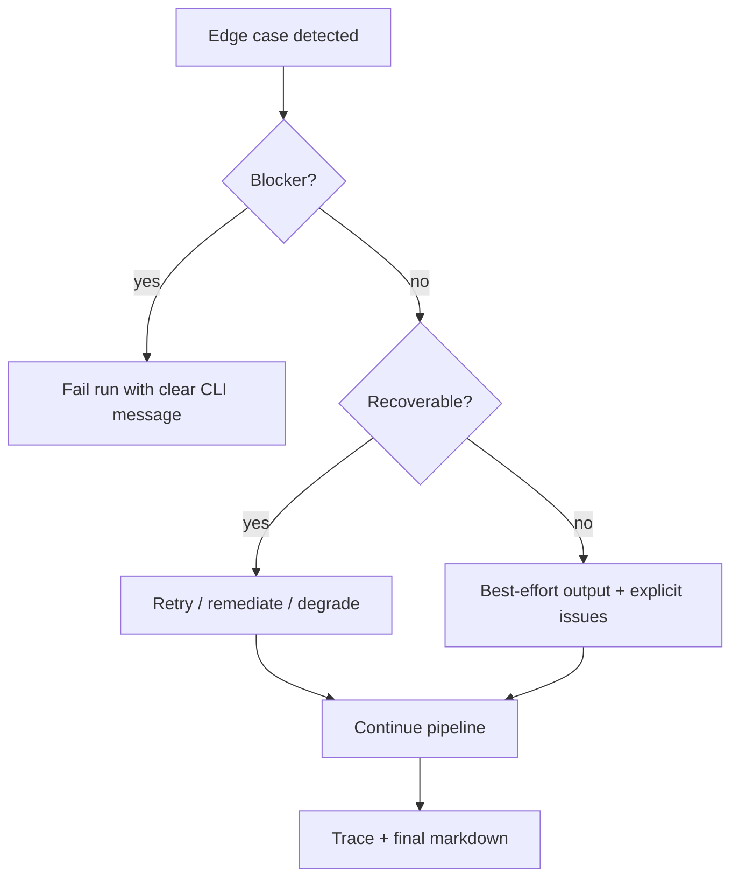

# Edge Cases — Travel Planning Multi-Agent System

Catalog of **edge cases and failure modes** for the fully LLM-driven MVP described in [implementation-plan.md](./implementation-plan.md). Each entry defines the scenario, expected system behavior, and which phase/agent owns the handling.

**Principle:** Fail visibly — never silently omit budget overruns, missing constraints, or agent errors.

---

## How to Use This Document

| Column | Meaning |
|--------|---------|
| **ID** | Stable reference for tests and evals |
| **Phase** | When this case should be handled (0–4) |
| **Owner** | Primary agent or component |
| **Severity** | `blocker` · `high` · `medium` · `low` |

Link each implemented test in `tests/` to an ID (e.g. `EC-P01`).

---

## 1. Request Parser Edge Cases

| ID | Scenario | Expected behavior | Owner | Severity |
|----|----------|-------------------|-------|----------|
| EC-P01 | **Missing budget** — no amount in request | Infer `budget_usd: null` or reasonable default; list in `assumptions`; Budget Agent uses mid-range estimates; Validator flags if spend cannot be checked | Request Parser | high |
| EC-P02 | **Missing duration** — "trip to Kyoto" with no days | Infer from context or default (e.g. 3 days); document assumption | Request Parser | high |
| EC-P03 | **Missing destinations** — "Japan trip, love food" | Infer country only or ask via `assumptions`; Validator may fail with clear issue | Request Parser | high |
| EC-P04 | **Ambiguous city names** — "Paris" (France vs Texas) | Prefer well-known destination; note assumption in `trip_spec.assumptions` | Request Parser | medium |
| EC-P05 | **Contradictory preferences** — "luxury on a $500 budget" | Parse both; Validator/Budget flag conflict | Request Parser | medium |
| EC-P06 | **Non-USD currency** — "₹60,000 budget" (Jaipur) | Parse amount + currency (`INR`); store in `trip_spec`; Budget keeps currency consistent end-to-end | Request Parser | high |
| EC-P07 | **Mixed currencies** — "$2,000 and ₹20,000" | Pick primary or fail with `assumptions` noting ambiguity | Request Parser | medium |
| EC-P08 | **Very large party** — "family of 12" | Set `party_size: 12`; Budget scales lodging/food/transport | Request Parser | medium |
| EC-P09 | **Single-word / empty request** — `""` or `"Japan"` | CLI rejects empty input; minimal input → sparse `trip_spec` + Validator issues | CLI / Parser | high |
| EC-P10 | **Conflicting constraints** — "hate crowds" + "love nightlife districts" | Parse both; Itinerary Composer balances; Validator checks both addressed | Request Parser | low |
| EC-P11 | **PII in request** — names, emails, phone numbers | Do not echo PII in trace exports; redact in logs if configured | Request Parser / Orchestrator | medium |

---

## 2. Destination Research Edge Cases

| ID | Scenario | Expected behavior | Owner | Severity |
|----|----------|-------------------|-------|----------|
| EC-D01 | **Obscure / small city** — lesser-known town | Return best-effort POIs; label confidence low in output | Destination Research | medium |
| EC-D02 | **Indian city (Jaipur)** — forts, bazaars, INR context | Same schema as international; India-specific POIs; crowd tips (early fort visits) | Destination Research | medium |
| EC-D03 | **Preference with no obvious match** — "love scuba" in landlocked city | Note gap in research; suggest nearest alternative or day trip in `assumptions` | Destination Research | medium |
| EC-D04 | **Too many destinations** — 6 cities in 4 days | Research all but Itinerary Composer / Validator flag overpacked schedule | Destination Research | high |
| EC-D05 | **"Avoid crowds" constraint** | Every city includes timing/area crowd-mitigation tips | Destination Research | high |
| EC-D06 | **LLM hallucinated POI** — invented attraction name | Accept for MVP (LLM-driven); label `estimated`; future: web search verify | Destination Research | low |

---

## 3. Accommodation Edge Cases

| ID | Scenario | Expected behavior | Owner | Severity |
|----|----------|-------------------|-------|----------|
| EC-A01 | **Ultra-low budget** — $30/night in Tokyo | Suggest realistic budget neighborhoods; Budget flags tight fit | Accommodation | high |
| EC-A02 | **Luxury travel_style** — with modest budget | Recommend upscale areas but Budget/Validator flag mismatch | Accommodation | medium |
| EC-A03 | **No destination_research** — upstream agent failed | Use `trip_spec` only; trace warning; degrade gracefully | Accommodation | high |
| EC-A04 | **Single city trip** — only Tokyo | One city's neighborhoods; no inter-city stay split | Accommodation | medium |
| EC-A05 | **Party size > 4** — needs multi-room / apartment | Suggest family-friendly areas; scale cost ranges | Accommodation | medium |

---

## 4. Transport Edge Cases

| ID | Scenario | Expected behavior | Owner | Severity |
|----|----------|-------------------|-------|----------|
| EC-T01 | **Single city** — no inter-city legs | `transport_plan` covers local + airport only; no fake inter-city routes | Transport | high |
| EC-T02 | **Circular route** — Tokyo → Kyoto → Tokyo | Plan legs in order; durations labeled `estimated` | Transport | medium |
| EC-T03 | **Impossible same-day hop** — 3 cities in 1 day | Transport estimates realistic durations; Validator flags if itinerary violates | Transport | high |
| EC-T04 | **No accommodation_options** — upstream failed | Plan from `trip_spec.destinations` only; trace warning | Transport | high |
| EC-T05 | **Jaipur ↔ Udaipur** — Indian inter-city | Train/road options; INR cost estimates; labeled `estimated` | Transport | medium |

---

## 5. Budget Edge Cases

| ID | Scenario | Expected behavior | Owner | Severity |
|----|----------|-------------------|-------|----------|
| EC-B01 | **Total exceeds budget** | `budget_breakdown.over_budget: true`; Validator fails; retry loop triggered | Budget | blocker |
| EC-B02 | **Missing budget in trip_spec** | Estimate total anyway; Validator notes budget check skipped | Budget | high |
| EC-B03 | **Currency mismatch** — USD spec, INR costs | Normalize to one currency or fail validation with clear issue | Budget | blocker |
| EC-B04 | **Groq vs Gemini disagree** — large cost delta | Gemini (Budget) is authoritative for totals; note variance in breakdown | Budget | medium |
| EC-B05 | **Zero or negative budget** | Reject or treat as error in Parser; Budget does not divide by zero | Budget | high |
| EC-B06 | **Partial upstream artifacts** — one gather agent failed | Budget uses available data; notes gaps in breakdown | Budget | high |

---

## 6. Itinerary Composer Edge Cases

| ID | Scenario | Expected behavior | Owner | Severity |
|----|----------|-------------------|-------|----------|
| EC-I01 | **Day count mismatch** — 4 days planned for 5-day spec | Validator fails on duration rule; retry with feedback | Itinerary Composer | blocker |
| EC-I02 | **City missing from outline** — Kyoto omitted | Validator fails destinations rule | Itinerary Composer | blocker |
| EC-I03 | **Preference never reflected** — no temple day despite "love temples" | Validator fails preferences rule | Itinerary Composer | high |
| EC-I04 | **Overpacked day** — 12 activities in one day | Validator or Composer notes feasibility; suggest trim on retry | Itinerary Composer | medium |
| EC-I05 | **Validation feedback on retry** — issues from Validator | Composer receives `validation_feedback`; adjusts draft only for listed issues | Itinerary Composer | high |

---

## 7. Validator Edge Cases

| ID | Scenario | Expected behavior | Owner | Severity |
|----|----------|-------------------|-------|----------|
| EC-V01 | **All rules pass** | `status: "pass"`, empty `issues[]` | Validator | — |
| EC-V02 | **Budget overage with explicit callout** | Pass budget rule only if overage documented in breakdown | Validator | high |
| EC-V03 | **Constraint "avoid crowds" not addressed** | Fail with specific issue; suggest early-morning / off-season tips | Validator | high |
| EC-V04 | **False pass** — LLM says pass but rules violated | Prefer deterministic pre-checks (day count, city list) before LLM judgment | Validator | blocker |
| EC-V05 | **False fail** — overly strict Validator | After max retries, return best-effort + issues (transparent) | Validator / Orchestrator | medium |

---

## 8. Orchestration & Pipeline Edge Cases

| ID | Scenario | Expected behavior | Owner | Severity |
|----|----------|-------------------|-------|----------|
| EC-O01 | **Malformed JSON from LLM** | JSON repair retry once; then agent retry; trace logs failure | Orchestrator | blocker |
| EC-O02 | **Agent timeout** | Single retry with backoff; then partial state + warning; pipeline continues if possible | Orchestrator | high |
| EC-O03 | **Groq API down** | Clear CLI error; no fake itinerary | Orchestrator | blocker |
| EC-O04 | **Gemini API down** | Budget/Validator fail visibly; gather may complete but run cannot finish | Orchestrator | blocker |
| EC-O05 | **Validation retry exhausted** | Return best-effort itinerary + `validation_report.issues` | Orchestrator | high |
| EC-O06 | **Parallel gather partial failure** — Research OK, Transport failed | Budget uses partial inputs; trace shows which agent failed | Orchestrator | high |
| EC-O07 | **Duplicate run_id collision** | UUID per run; no state collision | Orchestrator | low |
| EC-O08 | **Max retries = 0** | Configurable; single validation pass only | Orchestrator | low |
| EC-O09 | **Rate limit exceeded (RPM/RPD)** | Client waits for RPM; RPD raises `RateLimitExceededError` with clear message | LLM client | high |

---

## 9. LLM & Schema Edge Cases

| ID | Scenario | Expected behavior | Owner | Severity |
|----|----------|-------------------|-------|----------|
| EC-L01 | **JSON wrapped in markdown fences** | Strip fences before parse | LLM client | high |
| EC-L02 | **Truncated JSON** | Repair retry; then agent retry | LLM client | high |
| EC-L03 | **Extra fields in JSON** | Pydantic ignores or strips per model config | Schema layer | low |
| EC-L04 | **Wrong types** — string where int expected | Validation fails; agent retry | Schema layer | high |
| EC-L05 | **Empty LLM response** | Retry once; then agent failure | LLM client | high |
| EC-L06 | **Rate limit (429)** | Exponential backoff; single retry | LLM client | high |

---

## 10. Output & Explainability Edge Cases

| ID | Scenario | Expected behavior | Owner | Severity |
|----|----------|-------------------|-------|----------|
| EC-R01 | **Validation failed after retries** | Final markdown still renders; Validation section shows failures | Renderer | high |
| EC-R02 | **Missing artifact in state** | Section shows "unavailable" + trace warning | Renderer | medium |
| EC-R03 | **Very long itinerary** | Render without truncation; optional CLI `--summary` later | Renderer | low |
| EC-R04 | **Trace file write fails** | CLI still prints itinerary; stderr warning | Orchestrator | medium |

---

## 11. Security & Config Edge Cases

| ID | Scenario | Expected behavior | Owner | Severity |
|----|----------|-------------------|-------|----------|
| EC-S01 | **Missing GROQ_API_KEY** | Fail fast at startup with clear message | Config | blocker |
| EC-S02 | **Missing GEMINI_API_KEY** | Fail fast when Budget/Validator invoked | Config | blocker |
| EC-S03 | **`.env` committed to git** | Pre-commit / review catch; keys rotated | Dev process | blocker |
| EC-S04 | **API key in trace logs** | Never log keys; redact headers | Orchestrator | blocker |

---

## 12. Canonical Test Fixtures

Use these requests in manual and automated tests. Map to eval IDs in [eval.md](./eval.md).

| Fixture ID | Request | Primary edge cases exercised |
|------------|---------|------------------------------|
| FIX-JP | `Plan a 5-day trip to Japan. Tokyo + Kyoto. $3,000 budget. Love food and temples, hate crowds.` | Happy path (canonical) |
| FIX-IN | `Plan a 4-day trip to Rajasthan. Jaipur + Udaipur. ₹60,000 budget. Love forts and street food, hate crowds.` | EC-P06, EC-D02, EC-T05, INR currency |
| FIX-NB | `Weekend in Barcelona. Love architecture.` | EC-P01, EC-P02 (missing budget/duration) |
| FIX-LOW | `3 days Tokyo only. $400 total. Food focused.` | EC-B01, EC-A01 (tight budget) |
| FIX-MANY | `10 days: Tokyo, Kyoto, Osaka, Hiroshima, Nara. $2,000.` | EC-D04, EC-B01 (overpacked + over budget) |
| FIX-EMPTY | `""` | EC-P09 |
| FIX-SINGLE | `5 days in Kyoto. $1,500. Temples.` | EC-T01, EC-A04 |

---

## 13. Handling Matrix (Quick Reference)

| Failure type | First action | Second action | Final fallback |
|--------------|--------------|---------------|----------------|
| Malformed JSON | Repair parse | Agent retry | Agent failure in trace |
| Validation fail | Targeted Budget + Composer retry | Re-validate | Best-effort + issues |
| Agent timeout | Backoff retry | Partial state warning | Skip artifact if non-critical |
| API outage | Clear error | — | No fake itinerary |
| Budget overage | Retry loop | Document overage | Validator fail + visible issues |

---

## 14. Phase Mapping

| Phase | Edge cases to implement / test |
|-------|-------------------------------|
| 0 | EC-S01, EC-S02, EC-L03, EC-P09 (CLI empty) |
| 1 | EC-P01–P11, EC-D01–D06, EC-A01–A05, EC-T01–T05, EC-B01–B06, EC-I01–I03, EC-V01–V04, EC-L01–L06 |
| 2 | EC-O01–O08, EC-I05, EC-V05 |
| 3 | EC-R01–R04 |
| 4 | Full fixture suite (FIX-*), all blocker/high cases |

---

## Related Documents

| Document | Purpose |
|----------|---------|
| [implementation-plan.md](./implementation-plan.md) | Build phases and exit gates |
| [architecture.md](./architecture.md) | Agent contracts and orchestration |
| [eval.md](./eval.md) | Evaluation checklist linked to these cases |
