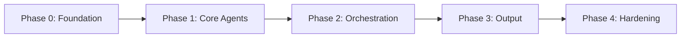
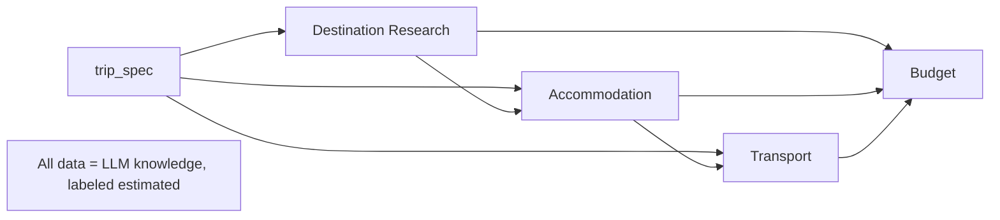
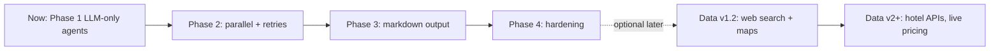
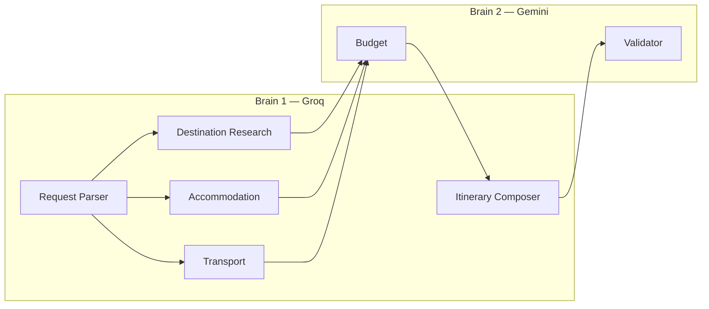

# Implementation Plan — Travel Planning Multi-Agent System

This plan breaks Milestone 4 into **sequential phases**. Each phase ends with a **gate**: its exit criteria must pass before the next phase starts. Track overall readiness in [eval.md](./eval.md).

Derived from [problemstatement.md](./problemstatement.md) and [architecture.md](./architecture.md).

---

## Current Scope Decision

> **We are currently using LLM-only data.** All destination, accommodation, transport, and budget information comes from the LLMs' internal knowledge, returned as structured JSON and **clearly labeled as estimates**. No external/live data sources (web search, maps, hotel/rail/flight APIs, curated datasets) are used yet.
>
> **Build phases 2–4 and data upgrades come later** — orchestration, markdown output, and hardening can be added next while **keeping LLM-only data**. External data sources (web search, maps, hotel APIs) are a **separate upgrade path** that swaps the data layer behind the same agent contracts.
>
> See [Implementation Status](#implementation-status), [Data Strategy](#data-strategy), and [Extension Roadmap](#extension-roadmap).

| Aspect | **Now (LLM-only)** | **Next (build phases 2–4)** | **Later (data upgrades)** |
|--------|--------------------|-----------------------------|---------------------------|
| Destination data | LLM knowledge | Still LLM | Web search + maps grounding |
| Accommodation data | LLM knowledge | Still LLM | Hotel search APIs |
| Transport data | LLM knowledge | Still LLM | Maps/distance + transit APIs |
| Budget data | Gemini reconciliation | Still LLM estimates | Real pricing feeds |
| Orchestration | Sequential pipeline | Parallel gather + retries | Unchanged |
| Output | JSON to stdout | Markdown + trace | Unchanged |
| State | In-memory per run | In-memory | Persisted to disk (v1.1) |

**Why LLM-only first:** fastest path to a working multi-agent demo; zero external API setup; orchestration and explainability are proven before investing in live data accuracy. Agent schemas and orchestration **do not change** when data sources are upgraded.

### Implementation Status

| Build phase | Name | Data mode | Code status |
|-------------|------|-----------|-------------|
| 0 | Foundation & scaffolding | — | ✅ Implemented |
| 1 | Core agents | **LLM-only** | ✅ Implemented (`run_pipeline`, 7 agents, prompts) |
| 2 | Orchestration & retry loop | **LLM-only** | ✅ Implemented (parallel gather, validation retries, trace) |
| 3 | Output & explainability | **LLM-only** | ✅ Implemented (markdown renderer, trace export, CLI) |
| 4 | Hardening & evals | **LLM-only** | ✅ Implemented (validator checks, edge cases, tests) |
| — | External data (v1.2+) | Web search / maps / APIs | ⬜ Deferred |

**Config:** `DATA_SOURCE=llm` in `.env` (only supported value today). Future values: `web_search`, `apis`.

---

## Two-Brain LLM Decision

> **We use two LLM providers so the system has two independent "brains":**
>
> | Brain | Provider | Agents | Role |
> |-------|----------|--------|------|
> | **Brain 1 — Gather & compose** | **Groq** | Request Parser, Destination Research, Accommodation, Transport, Itinerary Composer | Understand the request, research destinations, suggest stays and transport, compose the day-by-day plan |
> | **Brain 2 — Constrain & verify** | **Gemini** | Budget, Validator | Independently reconcile costs and verify the final plan against the original request |
>
> **Why two brains:** If one provider both *plans* and *judges* the plan, errors compound silently. Splitting providers means Gemini cross-checks Groq's gather-phase estimates (Budget) and independently validates the itinerary (Validator) — a real multi-agent consistency pattern, not just multiple prompts on the same model.

| Agent | Provider | Brain |
|-------|----------|-------|
| Request Parser | Groq | 1 |
| Destination Research | Groq | 1 |
| Accommodation | Groq | 1 |
| Transport | Groq | 1 |
| Itinerary Composer | Groq | 1 |
| Budget | Gemini | 2 |
| Validator | Gemini | 2 |

**API keys:** `GROQ_API_KEY` (Brain 1), `GEMINI_API_KEY` (Brain 2). See [LLM Routing](#llm-routing-two-brain-design) for model names and [API Rate Limits](#api-rate-limits) before Phase 1.

---

## API Rate Limits

Free-tier limits for our models. **Phase 1 must respect these** — rate limiting is built into the LLM clients (`src/travel_agent/llm/rate_limiter.py`).

### Groq — `llama-3.3-70b-versatile`

| Limit | Value | Config key |
|-------|-------|------------|
| Requests per minute (RPM) | **30** | `GROQ_RPM` |
| Requests per day (RPD) | **1,000** | `GROQ_RPD` |
| Tokens per minute (TPM) | **12,000** | `GROQ_TPM` |
| Tokens per day (TPD) | **100,000** | `GROQ_TPD` |

**Groq agents per run (happy path):** 5 calls — Parser, Research, Accommodation, Transport, Composer.

Phase 2 parallel gather fires **3 Groq calls at once** — within 30 RPM, but bursts add up across retries.

### Gemini 3 Flash

| Limit | Value | Config key |
|-------|-------|------------|
| Requests per minute (RPM) | **5** | `GEMINI_RPM` |
| Tokens per minute (TPM) | **250,000** | `GEMINI_TPM` |
| Requests per day (RPD) | **20** | `GEMINI_RPD` |

**Gemini agents per run (happy path):** 2 calls — Budget, Validator.

> **Gemini is the bottleneck.** At 2 calls/run, you get **~10 full runs/day** on the happy path. With validation retries and JSON repair, that drops to **~5 runs/day**. Plan development and demos accordingly.

### Calls per pipeline run

| Scenario | Groq calls | Gemini calls |
|----------|------------|--------------|
| Happy path | 5 | 2 |
| +1 validation retry | 6 | 4 |
| +JSON repair (×2 factor) | up to 12 | up to 8 |

The CLI prints a **quota preflight** summary before each run (see `print_quota_preflight`).

### Design decisions for free tier

| Decision | Default | Why |
|----------|---------|-----|
| `MAX_VALIDATION_RETRIES` | **1** (not 2) | Each retry adds 2 Gemini calls |
| `JSON_REPAIR_RETRIES` | **1** | Each repair = another API request |
| `GATHER_PARALLEL` | `true` | 3 Groq calls fit in 30 RPM; set `false` to serialize if throttled |
| `RATE_LIMIT_ENABLED` | `true` | Client-side RPM/RPD guard before each call |
| `GROQ_MAX_TOKENS` / `GEMINI_MAX_TOKENS` | `4096` | Keeps responses within TPM budget |
| Compact prompts | Phase 1 | Pass artifact slices only; full JSON schemas add tokens |

### Phase 1 prerequisite

Before implementing real agents, confirm `.env` matches your tier limits. Run `plan "test"` and check the preflight line on stderr.

---

## Phase Overview

| Phase | Name | Outcome | Gate |
|-------|------|---------|------|
| 0 | Foundation & scaffolding | Repo, config, schemas, LLM clients | Skeleton runs end-to-end with stub agents |
| 1 | Core agents (LLM-driven) | All 7 agents produce valid artifacts | Japan fixture passes validation |
| 2 | Orchestration & retry loop | Parallel gather + validation remediation | Forced overrun triggers retry, surfaces issues |
| 3 | Output & explainability | Final markdown itinerary + trace | "How this plan was built" renders |
| 4 | Hardening & evals | Edge cases, tests, observability | All eval criteria pass — milestone complete |



---

## Phase 0 — Foundation & Scaffolding

**Goal:** A runnable skeleton with config, schemas, and LLM clients before any agent logic.

### Tasks

1. **Project setup**
   - `pyproject.toml` with dependencies: `pydantic`, `pydantic-settings`, `groq`, `google-genai`, `python-dotenv`, `pytest`
   - Repository layout per [architecture.md §12](./architecture.md)
   - `.env.example` with `GROQ_API_KEY`, `GEMINI_API_KEY`; `.env` in `.gitignore`

2. **Configuration** (`src/config.py`)
   - `pydantic-settings` loading model names, timeouts, retry limits from env
   - Defaults: `MAX_VALIDATION_RETRIES=2`, `AGENT_TIMEOUT_S=60`, `JSON_REPAIR_RETRIES=1`

3. **State models** (`src/orchestrator/state.py`)
   - Pydantic models: `TripSpec`, `DestinationResearch`, `AccommodationOptions`, `TransportPlan`, `BudgetBreakdown`, `DraftItinerary`, `ValidationReport`, `TripState`, `RunMetadata`

4. **LLM clients** (`src/llm/`)
   - `groq_client.py` and `gemini_client.py` with a shared interface: `complete(system, user, schema) -> dict`
   - JSON-mode output + repair retry on parse failure

5. **Agent protocol** (`src/agents/base.py`)
   - `Agent` protocol: `run(state, context) -> state`
   - Stub agents returning empty/placeholder artifacts

6. **CLI skeleton** (`src/main.py`)
   - `plan "<request>"` parses args, builds `TripState`, runs stub pipeline, prints state

### Exit gate (Phase 0)

- [ ] `plan "test"` runs end-to-end with stub agents, no crash
- [ ] All Pydantic models import and validate sample JSON
- [ ] Both LLM clients authenticate and return a trivial completion
- [ ] `.env` not tracked by git

---

## Phase 1 — Core Agents (Fully LLM-Driven) ✅

**Goal:** Implement all seven agents using **LLM knowledge only** (no external APIs). **Status: implemented** in `src/travel_agent/agents/` and `run_pipeline()`.

> **Data decision:** Phase 1 uses **LLM-only data**. Build phases 2–4 will extend orchestration and output while **keeping the same LLM data layer**. External APIs are a later, optional upgrade — see [Extension Roadmap](#extension-roadmap).

### Tasks (per agent)

For each agent: write system prompt (`src/prompts/`), implement module, define output schema, add a fixture test.

1. **Request Parser** (Groq) → `trip_spec`
   - Extract duration, destinations, country, budget, preferences, constraints
   - Infer defaults (`party_size: 1`, `travel_style: "mid-range"`); list `assumptions`

2. **Destination Research** (Groq) → `destination_research`
   - Per city: POIs aligned to preferences, vibe, best times, crowd-avoidance tips, est. visit durations

3. **Accommodation** (Groq) → `accommodation_options`
   - Per city: neighborhoods matched to itinerary flow, sample lodging tiers, est. nightly cost ranges

4. **Transport** (Groq) → `transport_plan`
   - Inter-city legs (e.g. Tokyo ↔ Kyoto), airport transfers, local transit notes, pass suggestions, est. costs/durations

5. **Budget** (Gemini) → `budget_breakdown`
   - Cost estimates by category (lodging, transport, food, activities, buffer); flag over-budget risk; suggest tradeoffs

6. **Itinerary Composer** (Groq) → `draft_itinerary`
   - Allocate days across cities; sequence activities; weave in transport and stays

7. **Validator** (Gemini) → `validation_report`
   - Apply minimum rules ([architecture.md §7.7](./architecture.md)); emit `status`, `issues[]`, `suggestions[]`, `checks[]`

### Exit gate (Phase 1)

- [x] Seven agents implemented with Groq/Gemini routing and prompts
- [x] `run_pipeline()` runs sequential LLM pipeline; `plan --stub` for quota-free tests
- [ ] Each agent returns schema-valid output on the Japan fixture (live LLM run)
- [ ] `trip_spec` correctly parses the canonical request
- [ ] Validator passes the canonical Japan fixture
- [ ] Every estimate is labeled "estimated" in agent output

---

## Phase 2 — Orchestration & Retry Loop ✅

**Goal:** Wire the supervisor pipeline with parallel gather and validation remediation. **Status: implemented** in `orchestrator/pipeline.py` and `orchestrator/runner.py`.

> **Data:** Still **LLM-only** — Phase 2 improves *how* agents run, not *where* data comes from.

### Tasks

1. **Pipeline** (`src/orchestrator/pipeline.py`)
   - Phase 1 (Understand): Request Parser sequential
   - Phase 2 (Gather): Research + Accommodation + Transport via `asyncio.gather`
   - Phase 3 (Constrain): Budget
   - Phase 4 (Synthesize): Itinerary Composer
   - Phase 5 (Verify): Validator

2. **Retry / remediate**
   - On validation fail: attach `validation_report.issues` to `AgentContext.validation_feedback`
   - Re-run **Budget** and/or **Itinerary Composer** only (targeted), then re-validate
   - Stop after `MAX_VALIDATION_RETRIES`; return best-effort + unresolved issues

3. **Resilience**
   - Per-agent timeout; single retry with backoff on API error
   - Degrade gracefully with partial state + warning in trace

### Exit gate (Phase 2)

- [x] Pipeline phases: Understand → Gather → Constrain → Synthesize → Verify (+ Remediate)
- [x] Gather agents run concurrently when `GATHER_PARALLEL=true` (trace `parallel_group=gather`)
- [x] Validation fail triggers Budget + Composer retry with `validation_feedback`
- [x] After `MAX_VALIDATION_RETRIES`, best-effort + warning in `metadata.warnings`
- [x] Per-agent timeout and API retry with graceful degradation (`orchestrator/runner.py`)
- [ ] Forced budget overrun triggers retry loop on live LLM run (integration check)

---

## Phase 3 — Output & Explainability

**Goal:** Render the final markdown itinerary and PM-friendly trace.

> **Data:** Still **LLM-only** — renderer consumes existing artifacts.

### Tasks

1. **Renderer** (`src/orchestrator/renderer.py`)
   - Final itinerary sections: Overview, Day-by-day, Where to stay, Transport, Budget, Validation
   - "How this plan was built": parsed constraints table, agent contributions, budget line items, validator sign-off

2. **Trace export**
   - `outputs/{run_id}/trace.md` with per-agent inputs/outputs and timing
   - Structured JSON logs per `run_id`

### Exit gate (Phase 3)

- [x] Final output includes all 7 required sections ([architecture.md §6.4](./architecture.md))
- [x] "How this plan was built" renders with agent attribution
- [x] Trace file written per run

---

## Phase 4 — Hardening & Evals

**Goal:** Cover edge cases, add tests, confirm all acceptance criteria.

> **Data:** Still **LLM-only** — edge cases cover LLM output quality and orchestration failures.

### Tasks

1. Implement edge-case handling from [edgecases.md](./edgecases.md) (malformed JSON, missing budget, single city, impossible constraints)
2. Tests: `test_validator.py`, fixture golden-shape tests, parser unit tests
3. Run full [eval.md](./eval.md) checklist

### Exit gate (Phase 4 — Milestone)

- [x] All edge cases handled or explicitly reported
- [x] All eval criteria pass
- [x] Single CLI command produces full itinerary for canonical request

---

## Data Strategy

This section explains **how each agent obtains its data** for the four data-heavy concerns: **Destination, Accommodation, Transport, and Budget**.

### Guiding principle

> Phase 1 (MVP) is **fully LLM-driven**: data comes from the model's internal knowledge, returned as structured JSON and **clearly labeled as estimates**. No live booking, pricing, or inventory APIs are called. External data sources are layered in only in later phases, behind the same agent contracts — so swapping the data source never changes the orchestration.

### Data sourcing by phase

| Phase | Data source | Accuracy | Cost | Used when |
|-------|-------------|----------|------|-----------|
| **Phase 1 (MVP)** | LLM internal knowledge | Approximate, labeled "estimated" | LLM tokens only | Default / demo |
| **v1.2** | Web search grounding | Current, cited | Search API + tokens | Freshness needed |
| **v1.2** | Maps / distance APIs | Accurate routes/times | Maps API | Real transport durations |
| **v2+** | Hotel/flight/curated datasets | Real inventory/pricing | Paid APIs | Production accuracy |

### How data flows into each agent (Phase 1)



#### 1. Destination data (Destination Research Agent)

- **Source (Phase 1):** Groq LLM knowledge of attractions, food spots, temples, cultural sites
- **Inputs used:** `trip_spec.destinations`, `preferences`, `constraints`
- **What it produces:** per-city POIs, vibe, best visit times, crowd-avoidance hints, estimated visit durations
- **Grounding technique:** prompt includes `trip_spec`; output schema forces per-city structure; preferences (e.g. "food", "temples") drive POI selection; constraints (e.g. "hate crowds") drive timing/area hints
- **Labeling:** durations and "best times" tagged as `estimated`
- **Later phases:** optional web search for current opening hours / events; maps API for real geo clustering

#### 2. Accommodation data (Accommodation Agent)

- **Source (Phase 1):** Groq LLM knowledge of neighborhoods and lodging tiers
- **Inputs used:** `trip_spec` (budget, travel_style, party_size) + `destination_research` (so stays sit near key POIs/transit)
- **What it produces:** recommended neighborhoods per city, sample lodging tiers (budget/mid/upscale), estimated nightly cost ranges
- **Grounding technique:** neighborhoods chosen to match itinerary flow (near transit, food districts); cost ranges scaled to `travel_style`
- **Labeling:** nightly costs tagged as `estimated nightly range`
- **Later phases:** hotel search APIs (e.g. real availability/pricing) behind the same `accommodation_options` schema

#### 3. Transport data (Transport Agent)

- **Source (Phase 1):** Groq LLM knowledge of inter-city and local transit options
- **Inputs used:** `trip_spec.destinations` + `accommodation_options` (to plan transfers to/from chosen areas)
- **What it produces:** inter-city legs (mode, rough duration, est. cost), airport transfers, local transit notes, pass suggestions (e.g. rail passes)
- **Grounding technique:** routes derived from destination sequence; durations/costs estimated from typical known values
- **Labeling:** durations and fares tagged as `estimated`
- **Later phases:** maps/distance matrix APIs for real durations; rail/flight APIs for fares and schedules

#### 4. Budget data (Budget Agent)

- **Source (Phase 1):** Gemini LLM reconciliation (the **second "brain"**) over peer artifacts
- **Inputs used:** `trip_spec.budget_usd` + `destination_research` (activity costs) + `accommodation_options` (lodging) + `transport_plan` (transport)
- **What it produces:** `budget_breakdown` by category — lodging, transport, food, activities, buffer — with total vs. budget and over-budget flags
- **Grounding technique:** aggregates the estimates already produced upstream, adds food/activity estimates, applies a buffer; cross-checks against `budget_usd` ceiling
- **Why a different provider:** Gemini independently re-estimates costs rather than trusting Groq's gather-phase numbers blindly — this is the intentional "two brains" consistency layer
- **Labeling:** all line items `estimated`; explicit overage called out when total > budget
- **Later phases:** real pricing feeds replace category estimates; buffer logic stays the same

### Data quality & transparency rules

- Every numeric estimate carries an `estimated` flag or label in its schema
- The final itinerary's **Budget** section shows line items and total vs. `budget_usd`
- The Validator independently checks `estimated total ≤ budget_usd` (or documents the overage)
- No data is fabricated as "confirmed availability" — Phase 1 never claims live bookings

### Note on Indian cities (e.g. Jaipur)

For destinations like **Jaipur**, the same Phase-1 flow applies: LLM knowledge supplies forts/palaces/bazaars (preferences), neighborhood stays (e.g. near City Palace / Civil Lines), inter-city transport (e.g. Delhi ↔ Jaipur by train/road), and INR-aware budget estimates (convert/label currency clearly). Accuracy improves in later phases via search/maps APIs — the agent contracts do not change.

---

## Implementation Approaches (Current vs Later)

| Concern | Current (LLM-driven) | Future option |
|---------|----------------------|---------------|
| Destination data | LLM knowledge | Web search + maps grounding |
| Accommodation data | LLM knowledge | Hotel search API |
| Transport data | LLM knowledge | Maps/distance + transit APIs |
| Budget data | Gemini reconciliation of estimates | Real pricing feeds |
| State | In-memory per run | Persisted to disk (v1.1) |
| Approval | Automatic | Human-in-the-loop (v2) |

**Current decision:** `DATA_SOURCE=llm` only. Other approaches are documented here and can be adopted incrementally **without changing agent contracts or orchestration** — only the data source behind each agent is swapped.

---

## Extension Roadmap

Two independent tracks — you can complete build phases 2–4 **before** adding external data.



| Track | Phase | What changes | Data source |
|-------|-------|--------------|-------------|
| **Build** | 2 | `asyncio.gather` for gather agents; validation retry loop | LLM-only |
| **Build** | 3 | Markdown renderer; trace export | LLM-only |
| **Build** | 4 | Edge cases; full eval suite | LLM-only |
| **Data** | v1.1 | Persist `TripState` to disk | LLM-only |
| **Data** | v1.2 | Web search grounding; maps API for distances | Hybrid |
| **Data** | v2+ | Hotel/rail/flight APIs; human-in-the-loop approval | Live APIs |

**How to extend data later (no orchestration rewrite):**

1. Add `src/travel_agent/data/` providers (e.g. `llm_provider.py`, `maps_provider.py`)
2. Branch inside each gather agent on `settings.data_source`
3. Keep Pydantic output schemas identical — orchestrator unchanged

---

## LLM Routing (Two-Brain Design)

**Decision:** Groq powers **research, accommodation, transport** (plus parser and composer). Gemini powers **budget and validator**. This is intentional — see [Two-Brain LLM Decision](#two-brain-llm-decision).



| Agent | Provider | Model (example) | Brain | Why |
|-------|----------|-----------------|-------|-----|
| Request Parser | **Groq** | `llama-3.3-70b-versatile` | 1 | Fast structured extraction |
| Destination Research | **Groq** | `llama-3.3-70b-versatile` | 1 | Creative destination research |
| Accommodation | **Groq** | `llama-3.3-70b-versatile` | 1 | Neighborhood reasoning |
| Transport | **Groq** | `llama-3.3-70b-versatile` | 1 | Route and mode planning |
| Budget | Gemini | `gemini-3-flash` | 2 | Independent cost cross-check of Groq estimates |
| Itinerary Composer | **Groq** | `llama-3.3-70b-versatile` | 1 | Narrative synthesis |
| Validator | **Gemini** | `gemini-3-flash` | 2 | Independent QA — did the plan match the request? |

> **Groq** gathers and composes. **Gemini** reconciles budget and validates. Two providers = two brains: one team builds the plan, a second team checks cost and compliance.

**Rate limits:** See [implementation-plan.md § API Rate Limits](./implementation-plan.md#api-rate-limits). Clients enforce RPM/RPD via `rate_limiter.py`; Gemini RPD=20 is the daily bottleneck.

---

## Dependencies & Setup

```bash
# install
pip install -e .

# configure
cp .env.example .env   # add GROQ_API_KEY and GEMINI_API_KEY

# run
plan "Plan a 5-day trip to Japan. Tokyo + Kyoto. $3,000 budget. Love food and temples, hate crowds."
```

---

## Related Documents

| Document | Purpose |
|----------|---------|
| [problemstatement.md](./problemstatement.md) | Product intent and required outputs |
| [architecture.md](./architecture.md) | System architecture, agents, orchestration |
| [edgecases.md](./edgecases.md) | Edge cases and failure modes |
| [eval.md](./eval.md) | Evaluation checklist for milestone sign-off |
